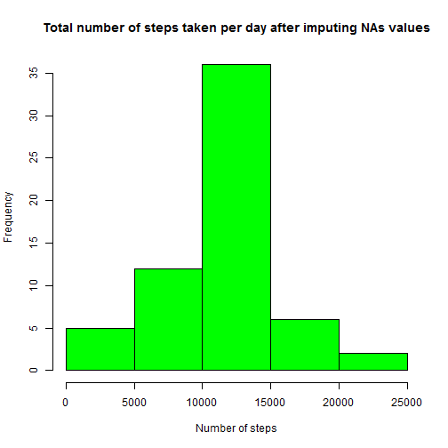

## Load needed libraries


```r
library(ggplot2)
library(knitr)
```

## Read data


```r
dat <- read.csv("activity.csv")
```


## Mean total number of steps taken per day

The total number of steps taken per day


```r
totalNbStepsPerDay <- tapply(dat$steps, dat$date, function(x) sum(x, na.rm = TRUE))
totalNbStepsPerDay
```

```
## 2012-10-01 2012-10-02 2012-10-03 2012-10-04 2012-10-05 2012-10-06 
##          0        126      11352      12116      13294      15420 
## 2012-10-07 2012-10-08 2012-10-09 2012-10-10 2012-10-11 2012-10-12 
##      11015          0      12811       9900      10304      17382 
## 2012-10-13 2012-10-14 2012-10-15 2012-10-16 2012-10-17 2012-10-18 
##      12426      15098      10139      15084      13452      10056 
## 2012-10-19 2012-10-20 2012-10-21 2012-10-22 2012-10-23 2012-10-24 
##      11829      10395       8821      13460       8918       8355 
## 2012-10-25 2012-10-26 2012-10-27 2012-10-28 2012-10-29 2012-10-30 
##       2492       6778      10119      11458       5018       9819 
## 2012-10-31 2012-11-01 2012-11-02 2012-11-03 2012-11-04 2012-11-05 
##      15414          0      10600      10571          0      10439 
## 2012-11-06 2012-11-07 2012-11-08 2012-11-09 2012-11-10 2012-11-11 
##       8334      12883       3219          0          0      12608 
## 2012-11-12 2012-11-13 2012-11-14 2012-11-15 2012-11-16 2012-11-17 
##      10765       7336          0         41       5441      14339 
## 2012-11-18 2012-11-19 2012-11-20 2012-11-21 2012-11-22 2012-11-23 
##      15110       8841       4472      12787      20427      21194 
## 2012-11-24 2012-11-25 2012-11-26 2012-11-27 2012-11-28 2012-11-29 
##      14478      11834      11162      13646      10183       7047 
## 2012-11-30 
##          0
```

```r
hist(totalNbStepsPerDay, main = "Total number of steps taken per day", xlab = "Number of steps", col = "green")
```

 

The mean of the total number of steps taken per day


```r
mean(totalNbStepsPerDay)
```

```
## [1] 9354.23
```


The median of the total number of steps taken per day


```r
median(totalNbStepsPerDay)
```

```
## [1] 10395
```

## Average daily activity pattern


```r
meanStepsPerInterval <- tapply(dat$steps, dat$interval, function(x) mean(x, na.rm = TRUE))

plot(cbind(as.numeric(names(meanStepsPerInterval)), meanStepsPerInterval), type = "l", main = "Mean of steps per interval taken all days", xlab = "Intervals", ylab = "Mean of steps per interval")
```

 

The interval containing the maximum number of steps 


```r
which.max(meanStepsPerInterval)
```

```
## 835 
## 104
```

The interval is 835.


## Imputing missing values

Calculate and report the total number of missing values in the dataset


```r
sum(!complete.cases(dat))
```

```
## [1] 2304
```

For missing values, we compute the mean of the number of steps per interval.
For each missing number of steps, we replace the "NA" value by the mean for the same interval.

So, first, we compute the indices of the NAs steps values.

For each NA steps value, we replace with the average number of steps for the same interval. 


```r
dataWithoutNAs <- dat
naSteps <- which(is.na(dataWithoutNAs$steps))

for(i in naSteps){
    dataWithoutNAs[i,"steps"] <- meanStepsPerInterval[as.character(dat[i,"interval"])]
}
```


The total number of steps taken per day after imputing NA values


```r
totalNbStepsPerDayNoNA <- tapply(dataWithoutNAs$steps, dataWithoutNAs$date, function(x) sum(x, na.rm = TRUE))

hist(totalNbStepsPerDayNoNA, main = "Total number of steps taken per day after imputing NAs values", xlab = "Number of steps", col = "green")
```

 

The mean of the total number of steps taken per day after imputing NA values


```r
mean(totalNbStepsPerDayNoNA)
```

```
## [1] 10766.19
```


The median of the total number of steps taken per day after imputing NA values


```r
median(totalNbStepsPerDayNoNA)
```

```
## [1] 10766.19
```


## Comparing activity patterns between weekdays and weekends


```r
# Create the new variable for weekend day and week day
dataWithoutNAs$weekday <- weekdays(as.Date(dataWithoutNAs$date, "%Y-%m-%d"))
dataWithoutNAs <- transform(dataWithoutNAs, weekday = ifelse(weekday %in% c("samedi", "dimanche", "saturday", "sunday"), "weekend", "weekday"))
   
stepsByIntervalMean2 <- aggregate(steps ~ interval + weekday, data=dataWithoutNAs, mean)
colnames(stepsByIntervalMean2) <- c("Interval","weekend","avgSteps")


plot <- ggplot(stepsByIntervalMean2, aes(Interval, avgSteps)) + 
    geom_line(col = "blue") + 
    facet_grid(weekend ~ .) +
    xlab("Interval") + 
    ylab("Average Steps in Interval")

plot
```

 
